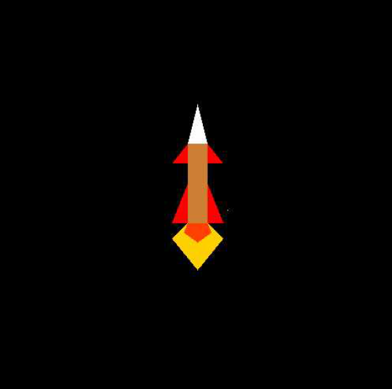

# Rocket Launch Simulation

This is a simple computer graphics project simulating a rocket launch using C and OpenGL. The project displays a rocket taking off from the ground and ascending into the sky.

## Features

- **Static Rocket Display**: Initially, the rocket is displayed on the ground.
- **Rocket Lift-off Animation**: The rocket lifts off from the ground and ascends into the sky.
- **Dynamic Background**: Stars twinkle in the sky during the rocket's ascent.

## Screenshots

*Rocket taking off from the ground*

*Rocket ascending into the sky*

*Rocket reaching into the space*

## Prerequisites

- C compiler
- OpenGL library

## Usage

1. Compile the C code with the OpenGL library.
2. Run the compiled executable.

## Code Overview

### Libraries Used
- `GL/glut.h`: OpenGL Utility Toolkit for graphics rendering.
- `stdlib.h`, `stdio.h`, `math.h`, `string.h`: Standard C libraries.

### Functions
- `semicircle(float radius,float u,float v)`: Draws a semicircle at given coordinates and radius.
- `display1()`: Main display function handling rocket animation.
- `stars()`, `stars1()`: Functions to draw twinkling stars in the sky.
- `static_rocket()`: Displays the rocket on the ground.
- `rocket_to_cam_pos()`: Animation for rocket lift-off.
- `rocket_in_motion()`: Animation for rocket ascending into the sky.
- `mars(float radius)`: Draws Mars (not implemented in this code).

### Main Functionality
1. The rocket is initially displayed on the ground.
2. The rocket lifts off and ascends into the sky with a dynamic background of twinkling stars.

## Contributors

- [Devil-Code] - [https://github.com/Devil-Code]

## License

This project is licensed under the [GNU GPL v3.0](LICENSE).

## Contact Information

For any inquiries or issues, please contact:
- **Pritesh Gandhi**
- **Email**: pgandhi1412@gmail.com
- **GitHub**: [GitHubProfile](https://github.com/Devil-Code)

